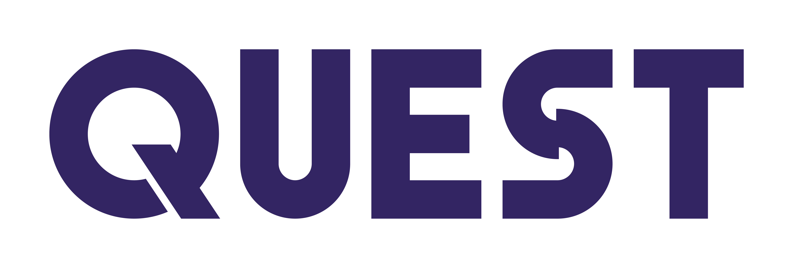

# 🚀 Quest Extension - 智能网页洞察收集器

<div align="center">



**让网页浏览更智能，让知识收集更高效**

[](https://chrome.google.com/webstore/)
[](https://github.com/your-username/quest-extension)
[](LICENSE)

</div>

## ✨ 功能特性

- 🔍 **智能洞察保存** - 一键保存网页内容到你的Quest空间
- 🔐 **多种登录方式** - 支持邮箱/密码和Google OAuth登录
- 🏷️ **智能标签系统** - 轻松组织和分类内容
- 🤖 **自动元数据提取** - 自动获取页面标题、描述和图片
- 🧠 **AI增强功能** - 文本处理和智能摘要
- 👤 **个性化头像** - Google用户显示真实头像

## 🖼️ 界面预览

<div align="center">

</div>

## 🚀 快速开始

### 安装方式

#### 方式一：Chrome Web Store（推荐）
1. 访问 [Chrome Web Store](https://chrome.google.com/webstore/)
2. 搜索 "Quest Insight Collector"
3. 点击"添加至 Chrome"

#### 方式二：手动安装
1. 下载最新版本的发布包
2. 解压到本地文件夹
3. 打开Chrome，访问 `chrome://extensions/`
4. 开启"开发者模式"
5. 点击"加载已解压的扩展程序"
6. 选择解压后的文件夹

### 首次使用
1. 点击扩展图标
2. 选择登录方式：
   - **Google登录**（推荐）- 快速便捷
   - **邮箱注册** - 创建新账户
3. 开始收集网页洞察！

## 📖 使用指南

### 保存洞察
1. 浏览任意网页
2. 点击扩展图标
3. 页面信息自动填充
4. 添加你的想法和评论
5. 选择相关标签
6. 点击"保存到收藏"

### 标签管理
- 选择现有标签
- 创建新标签
- 标签颜色管理
- 多标签关联

## 🔧 技术架构

### 前端技术
- **Manifest V3** - 最新Chrome扩展标准
- **Vanilla JavaScript** - 轻量级，无依赖
- **Chrome APIs** - 身份验证、存储、标签页
- **Google OAuth 2.0** - 安全的第三方登录

### 后端集成
- **REST API** - https://quest-api-edz1.onrender.com
- **JWT认证** - 安全的用户会话管理
- **自动元数据提取** - 智能内容识别

### 项目结构
```
quest-extension/
├── manifest.json         # 扩展配置
├── popup.html            # 用户界面
├── popup.js              # 主要逻辑
├── background.js         # 后台服务
├── content-script.js     # 内容脚本
├── icons/                # 扩展图标
└── docs/                 # 项目文档
```

## 🔐 隐私与安全

- ✅ **最小权限原则** - 仅请求必要权限
- ✅ **数据加密** - 所有数据传输使用HTTPS
- ✅ **本地存储** - 会话信息安全存储
- ✅ **OAuth 2.0** - 安全的第三方认证
- ✅ **无追踪** - 不收集用户浏览行为

## 🛠️ 开发指南

### 环境要求
- Chrome 88+
- 现代代码编辑器
- Git

### 本地开发
```bash
# 克隆仓库
git clone https://github.com/your-username/quest-extension.git
cd quest-extension

# 在Chrome中加载扩展
# 1. 打开 chrome://extensions/
# 2. 开启开发者模式
# 3. 点击"加载已解压的扩展程序"
# 4. 选择项目文件夹
```

### 配置Google OAuth
1. 访问 [Google Cloud Console](https://console.cloud.google.com/)
2. 创建OAuth 2.0客户端ID
3. 配置扩展重定向URI
4. 更新`manifest.json`中的client_id

详细配置请参考：[Google OAuth配置指南](docs/GOOGLE_OAUTH_SETUP.md)

## 📋 待办事项

- [ ] 支持更多浏览器（Firefox, Safari）
- [ ] 离线功能支持
- [ ] 批量操作
- [ ] 数据导出功能
- [ ] 高级搜索和过滤
- [ ] 团队协作功能

## 🤝 贡献指南

我们欢迎任何形式的贡献！

### 如何贡献
1. Fork 本仓库
2. 创建功能分支 (`git checkout -b feature/AmazingFeature`)
3. 提交更改 (`git commit -m 'Add some AmazingFeature'`)
4. 推送到分支 (`git push origin feature/AmazingFeature`)
5. 创建Pull Request

### 报告问题
- 使用GitHub Issues报告bug
- 提供详细的复现步骤
- 包含Chrome版本和错误截图

## 📄 许可证

本项目基于 MIT 许可证开源 - 查看 [LICENSE](LICENSE) 文件了解详情。

## 🙏 致谢

- [Chrome Extensions API](https://developer.chrome.com/docs/extensions/)
- [Google OAuth 2.0](https://developers.google.com/identity/protocols/oauth2)
- 所有贡献者和用户的支持

## 📞 联系我们

- 📧 Email: [your-email@example.com](mailto:your-email@example.com)
- 🐛 Bug报告: [GitHub Issues](https://github.com/your-username/quest-extension/issues)
- 💬 讨论: [GitHub Discussions](https://github.com/your-username/quest-extension/discussions)

---

<div align="center">

**如果这个项目对你有帮助，请给它一个 ⭐️**

Made with ❤️ by [Your Name](https://github.com/your-username)

</div>
